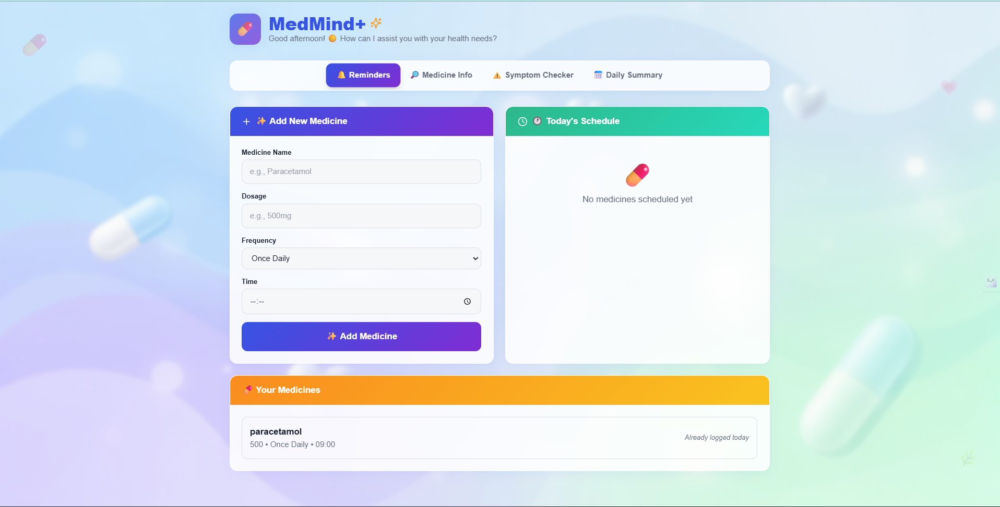
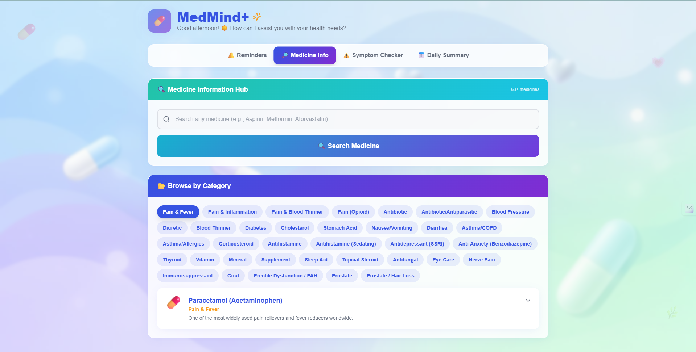
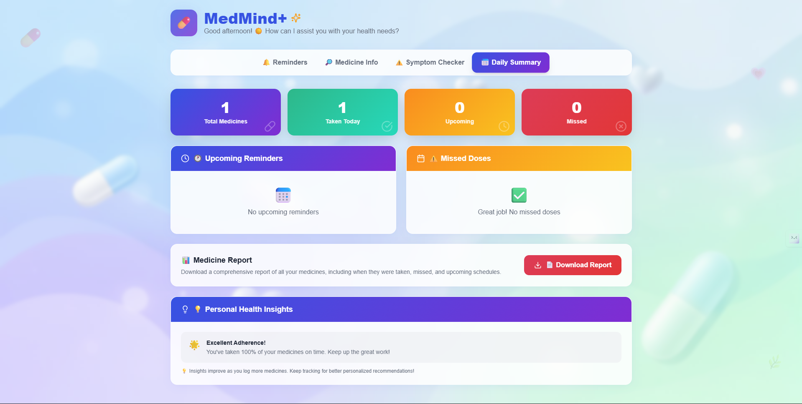

# 🧠 MedMind+

### AI-Powered Healthcare Companion


MedMind+ is a modern AI-assisted healthcare companion designed to support daily health management through intelligent reminders, medication awareness, symptom guidance, and personalized health summaries.

Built with a scalable full-stack architecture, MedMind+ delivers a secure, fast, and intuitive healthcare assistance experience.

---

## 🚀 Overview

MedMind+ helps users stay proactive about their health by combining smart automation with accessible medical insights.

The system is designed to be simple for everyday users while maintaining a robust architecture suitable for real-world healthcare applications.

---

## 🎯 Key Features

### 🔔 Smart Reminders

Receive timely alerts for medications and health routines to ensure adherence and consistency.

### 🔎 Medicine Information

Quickly access essential medication details including usage guidance and precautions.

### ⚠️ Symptom Checker

Analyze symptoms to gain awareness of possible health concerns and suggested actions.

### 📅 Daily Health Summary

Track daily health activities and reminders in a clear, structured dashboard.

---

## 🖼 Application Screens

### 🔔 Reminders


### 🔎 Medicine Info


### ⚠️ Symptom Checker


### 📅 Daily Summary


---

## 🏗 System Architecture

MedMind+ follows a modern cloud-based architecture ensuring performance, security, and scalability.

```
                ┌──────────────────────┐
                │      User Device     │
                │  (Mobile / Desktop) │
                └──────────┬──────────┘
                           │
                           ▼
                ┌──────────────────────┐
                │     React Frontend   │
                │   (Vite + Tailwind)  │
                └──────────┬──────────┘
                           │ API Requests
                           ▼
                ┌──────────────────────┐
                │   Supabase Backend   │
                │----------------------│
                │ • Authentication     │
                │ • PostgreSQL DB      │
                │ • Storage            │
                │ • Security Policies  │
                └──────────┬──────────┘
                           │
                           ▼
                ┌──────────────────────┐
                │   Cloud Infrastructure│
                │   & Data Services    │
                └──────────────────────┘
```

---

## 🔄 Data Flow

1️⃣ User interacts with MedMind+ interface
2️⃣ Frontend sends secure API requests
3️⃣ Supabase handles authentication & database operations
4️⃣ Health data is securely stored & retrieved
5️⃣ Processed results are displayed in the dashboard

---

## 🧩 Architecture Highlights

✅ Cloud-powered backend
✅ Secure authentication & data handling
✅ Scalable serverless infrastructure
✅ Real-time data readiness
✅ Modular & maintainable design

---

## 🏗 Technology Stack

### Frontend

* React + TypeScript
* Vite
* Tailwind CSS
* Radix UI Components

### Backend & Cloud

* Supabase (Authentication, Database & Storage)
* PostgreSQL Database
* Cloud Security Policies

### State & Form Management

* TanStack React Query
* React Hook Form
* Zod Validation

---

## 🔐 Security & Privacy

MedMind+ follows secure development practices:

* Secure authentication via Supabase
* Protected environment variables
* No sensitive data stored on client side
* Controlled database access policies

---

## ⚙️ Installation & Setup

### 1️⃣ Clone Repository

```bash
git clone https://github.com/RGTrigger/MedMindPlus.git
cd MedMindPlus
```

### 2️⃣ Install Dependencies

```bash
npm install
```

### 3️⃣ Configure Environment Variables

Create `.env` file:

```
VITE_SUPABASE_URL=your_url
VITE_SUPABASE_ANON_KEY=your_key
```

### 4️⃣ Run Development Server

```bash
npm run dev
```

Open:

```
http://localhost:8080
```

---

## 📦 Production Build

```bash
npm run build
npm run preview
```

---

## 🌍 Use Cases

* Personal health management
* Medication adherence support
* Preventive healthcare awareness
* Digital caregiver assistance
* Elderly health monitoring

---

## 🔮 Future Enhancements

* AI-driven health insights
* Emergency SOS & alerts
* Doctor consultation integration
* Wearable device synchronization
* Multilingual support
* Voice-assisted interaction

---

## 👨‍💻 Author

**Gaurav Kumar**
B.Tech – Computer Science & Communication Engineering
KIIT Deemed to be University

GitHub: https://github.com/RGTrigger

---

## 📜 License

This project is developed for educational, research, and innovation purposes.

---

## ⭐ Acknowledgment

MedMind+ is built using modern open-source technologies and inspired by the goal of making healthcare support more accessible and intelligent.

---

If you want next:

• add GitHub stats badges
• create an architecture diagram image
• add deployment section
• create hackathon submission version
• build a portfolio version

Just tell me.

Best regards,
ChatGPT
